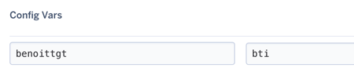

# TaigaToSlack

Get notified in Slack when something changes on Taiga
## Installation

Or get the project and :
```sh
$ mix deps.get
$ iex -S mix run --no-halt
```
You can specify the `PORT` using env variable. By default it's 8080.

## Setup

### Slack
To use TaigaToSlack you need to get first [a token from Slack](https://api.slack.com/docs/token-types).
Set this token to the env variables `SLACK_API_TOKEN`.

### Nicknames

As slack token. Nicknames need to be set as env variables. **Export variables without `@`** :
```sh
export mynicknameontaiga=mynicknameonslack
```

In Heroku it looks like this :



Taiga nickname on the left, slack nickname on the right.

### Taiga webhook

In Taiga (Admin > Integration > Webhooks) add the configuration for your TaigaToSlack
`Name : Taiga to Slack bot `, `Url : https://myserver.io/taiga-to-slack`, `Key: whatever`

Then try it.

Feel free to open issue and PR.

